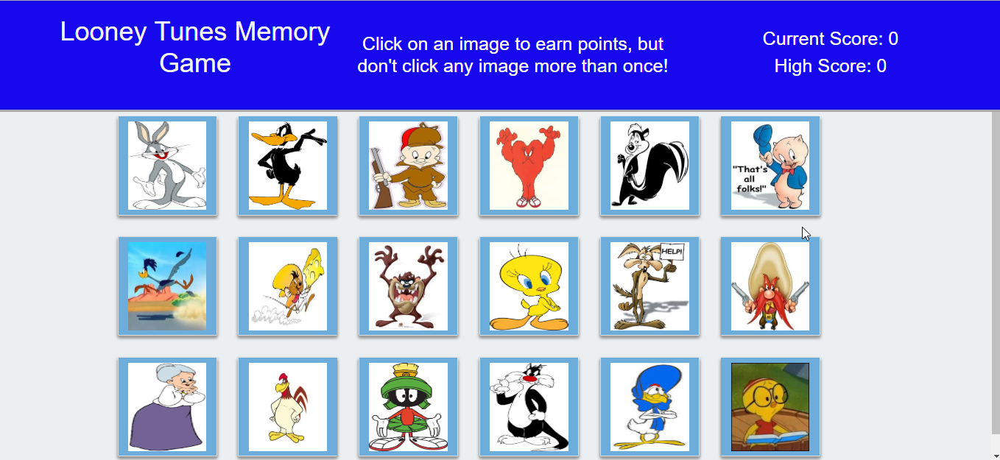

# React-Memory-Game

Rhonda Johnson

Week 19 assignment

## Overview

React is used to create the Memory Game.  The application's UI is broken up into components.  The component's state is managed.  The app responds to user events. 

The application keeps track of the user's score and the high score.  The score is incremented when clicking an image for the 1st time.  The score resets to 0 if the user clicks an image more than once.  Once the user's score is reset after an incorrect guess, the game will restart.

# Link to deployed project
https://mongoscraper199.herokuapp.com/

# Links to GitHub
https://github.com/rmxjohnson/React-Memory-Game.git

## Home Page

# Additional Features
 * The header message changes based on the user's actions.  When the game is over, the message is displayed in orange.
